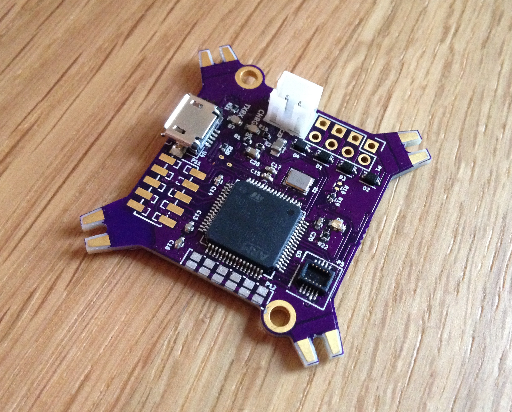
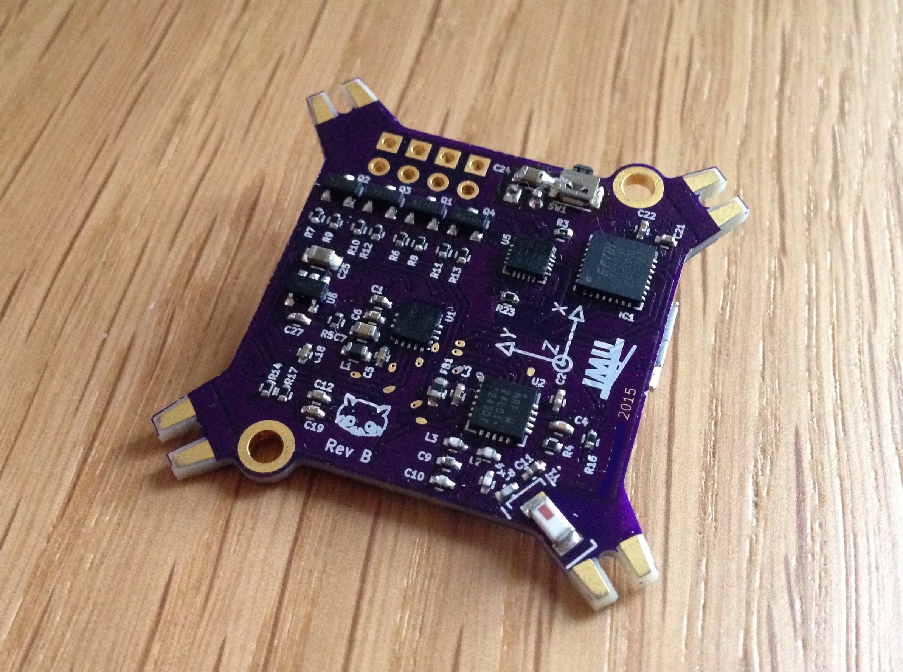

Quadcopter or general 6 DOF IMU
===========================

## Hardware

* ARM Cortex-M4, STM32F405, 168 MHz, FPU
* Accelerometer and gyro ICM20608
* 2.4 GHz Transceiver nRF24L01+
* USB Power Manager with Li-Ion charger LTC3553
* USB to serial UART interface FT232RQ 

 